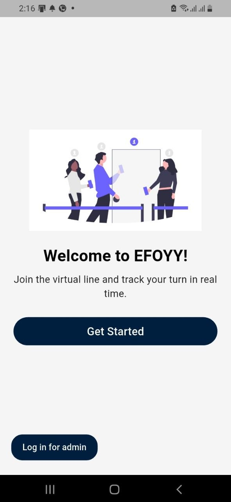

# Efoy (እፎይ) - Hospital Patient Relief App




A comprehensive Flutter MVP app designed to solve critical problems in Ethiopian public hospitals, providing relief for both smartphone and button phone users.

## 🇪🇹 Overview

Efoy addresses 4 major problems reported by hospital staff:

1. **Long waiting at OPD** - Patients sit all day hoping their name is called
2. **No digitalized index card** - Patients lose paper cards and forget appointments
3. **No pre-op/post-op instructions** - Doctors too busy to explain everything
4. **Difficult to find investigation rooms** - Main suffering for patients and attendants

## ✨ Key Features

### 1. OPD Queue Relief
- Smart queue management with realtime updates
- **Smartphone users**: Live ticket screen with 3D glowing orb animation, position tracking, ETA countdown
- **Button phone users**: Automatic SMS updates every 10-15 minutes with queue position and estimated time
- Urgent SMS when it's their turn

### 2. Digital Index Card
- Permanent patient ID (EFOY-XXX format)
- **Smartphone**: Beautiful offline digital card with QR code, photo, appointment history
- **Button phone**: SMS card with ID and next appointment details
- Automatic reminder SMS 2 days before appointment

### 3. Pre-Op & Post-Op Instructions
- Tailored guides sent after doctor visit or surgery scheduling
- **Smartphone**: Beautiful animated screens with voice guidance in Amharic
- **Button phone**: SMS series with step-by-step instructions

### 4. Hospital Navigation
- Indoor navigation to Lab, X-Ray, Pharmacy, OPD
- **Smartphone**: Interactive map with glowing path + voice directions in Amharic
- **Button phone**: Clear SMS directions with step-by-step instructions

### 5. Admin Dashboard
- Realtime queue management for hospital staff
- "Call Next" button with automatic SMS/push notifications
- Manual patient registration for button phone users

## 🛠 Tech Stack

- **Flutter 3.x** with **Riverpod 2.x** for state management
- **Supabase** (supabase_flutter ^2.5.0) - Auth, realtime queues, patient records
- **SMS**: Yegara SMS API or AfroMessage for button phone users
- **Offline Storage**: Hive 2.x for smartphone users
- **UI**: Material 3 + GoRouter + Lottie/Rive animations
- **3D Effects**: three_dart for glowing countdown orb
- **Maps**: flutter_map with offline tiles
- **Voice**: flutter_tts for Amharic directions
- **QR Scanner**: mobile_scanner
- **Notifications**: flutter_local_notifications + vibration
- **Localization**: Full Amharic (default) + English toggle


```
